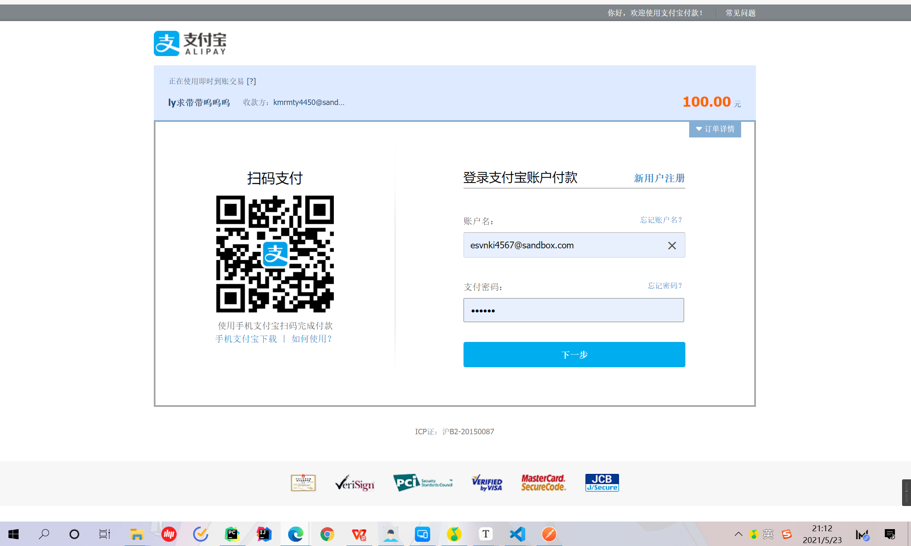
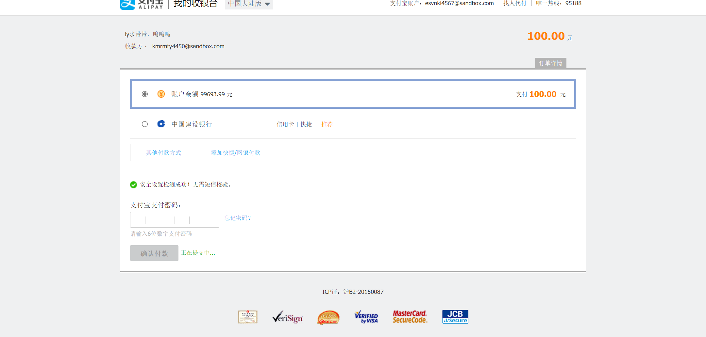
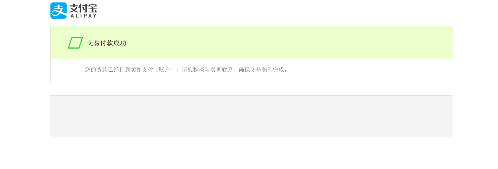

# django-Alipay


弄完之后发现也没啥。。也没什么改进。。。不过是精简了不少。。也可以直接使用了。。return url还是没地方弄。。先保留了。。附上[原作](https://github.com/xyjw/Django3-Web)的地址吧,原书的第九章支付宝部分 ：具体文件目录： Django3-Web-master\chapter9\babys\shopper

原作是电商网站，对周佬的项目好像有帮助似的，（但是前端是html） 书籍是精通Django 3Web 开发，作者黄永祥现在图书馆没货。。但是三天内（5/26）前可以预约一本就拿到手了


代码中大部分需要修改成自己的东西的地方我基本使用 `# TODO` 标记，

主要是:

```
app_id:	2021000117663085
公钥
私钥
（在线工具生成记得生成非Java（python）版

查看网址：https://openhome.alipay.com/platform/appDaily.htm?tab=info 
用户账号：esvnki4567@sandbox.com 111111
商家账号：kmrmty4450@sandbox.com 111111
```


环境依赖：

```
pip install pycryptodome
pip install python-alipay-sdk// 第三方支付宝的包

```


[支付宝沙箱文档](https://opendocs.alipay.com/open/200/105311)

[支付宝沙箱环境控制台](https://open.alipay.com/platform/developerIndex.htm)

修改部分：


不多，view文件中的

```python
from .pays import get_pay
url = get_pay(out_trade_no, total, return_url) 
```

返回url这里，虽然没用上，但是要求的包：`pip install pycrypto ``pip install alipay-sdk-python`装不了，，有python和vs的限制（需要14的VS）。到服务器上应该也用不了果断放弃


测试截图








